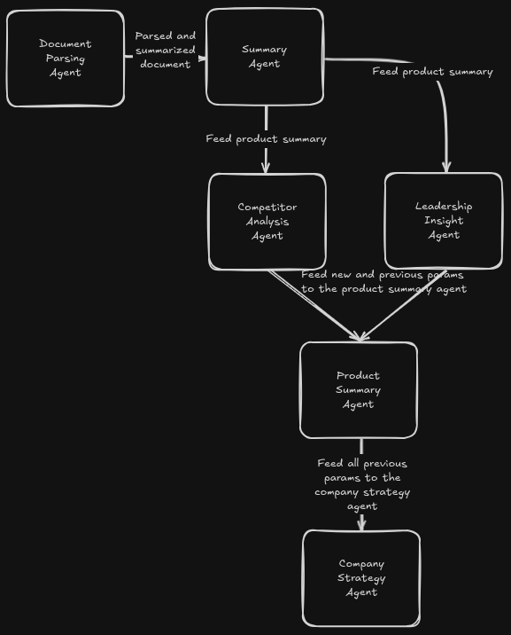

# System Design

## Overview
The system is designed to function as a multi-agent architecture that processes and analyzes sales insights for a given target company. Each agent has a specific responsibility, and together they form a chain-of-thought reasoning system to generate comprehensive business insights. The flow of information is structured to ensure progressive enrichment of data before the final analysis is performed.

## Architecture
The system follows a hierarchical agent-based design, as illustrated in the provided diagram. The key components are:

### 1. **Document Parsing Agent**
   - **Input:** Raw product overview document (PDF, DOCX, TXT)
   - **Processing:** Extracts textual data, removes noise, and summarizes key points.
   - **Output:** Parsed and summarized document

### 2. **Summary Agent**
   - **Input:** Summarized document from the Document Parsing Agent
   - **Processing:** Generates a concise summary of the product information.
   - **Output:** Product summary

### 3. **Competitor Analysis Agent**
   - **Input:** Product summary from Summary Agent
   - **Processing:** Identifies competitor companies, analyzes their strengths/weaknesses, and extracts key comparisons.
   - **Output:** Competitor analysis report

### 4. **Leadership Insight Agent**
   - **Input:** Product summary from Summary Agent
   - **Processing:** Identifies key decision-makers, extracts their public statements, and derives strategic insights.
   - **Output:** Leadership insights

### 5. **Product Summary Agent**
   - **Input:** Product summary, competitor analysis, and leadership insights
   - **Processing:** Combines all previous data, refines insights, and ensures coherence before passing it to the final analysis agent.
   - **Output:** Refined product summary

### 6. **Company Strategy Agent**
   - **Input:** All previous agent outputs
   - **Processing:** Develops a holistic understanding of the target company’s market positioning, competitive landscape, and future directions.
   - **Output:** Final strategic insights report

## Data Flow
The information propagates in a structured manner, ensuring that each agent builds upon the knowledge extracted by the preceding agents. This chain-of-thought approach enhances the relevance and depth of insights generated.

